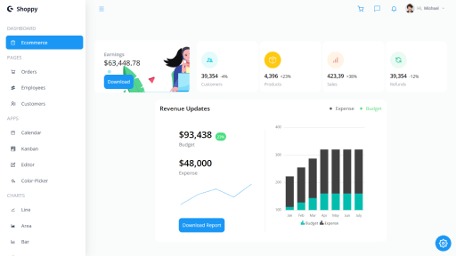
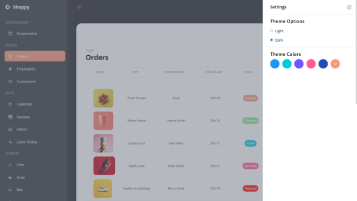
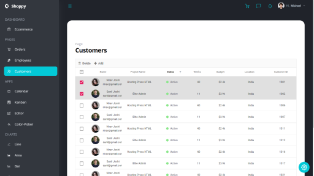
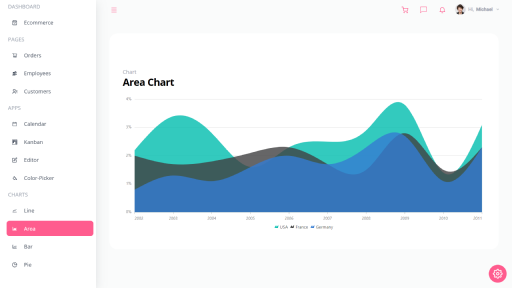
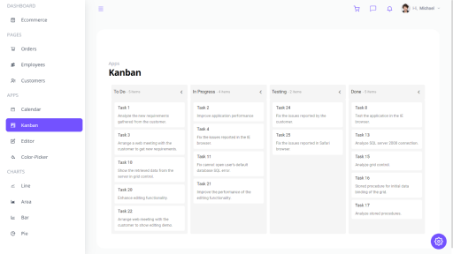

# React Dashboard

An Admin Dashboard application built completely with React.js and Tailwind CSS. It's completely functional and can be used as admin dashboard for various applications like Ecommerce management, Library Management, etc. The project is completely mobile responsive and customisable dashboard. The admin panel includes one dashboard, three pages, four apps and four charts.

The Apps, Charts and Pages are all functional. They are filled with dummy data right now, but can be integrated with the backend to represent the actual data. We can also perform various operations on these pages like searching, sorting, addition of new data, as well as deletion of the already present data from the same panel itself.

### Key Features

* Mobile Responsive
* Fully Customisabe (Theme Color and Dark Mode Settings)
* Various Data Visualisation Charts available which are functional
* Apps like Calendar, Progress List, Editor, etc. available in the panel
* The pages are functional. One can add, delete, search and sort data in the table.

### Results

     

    

